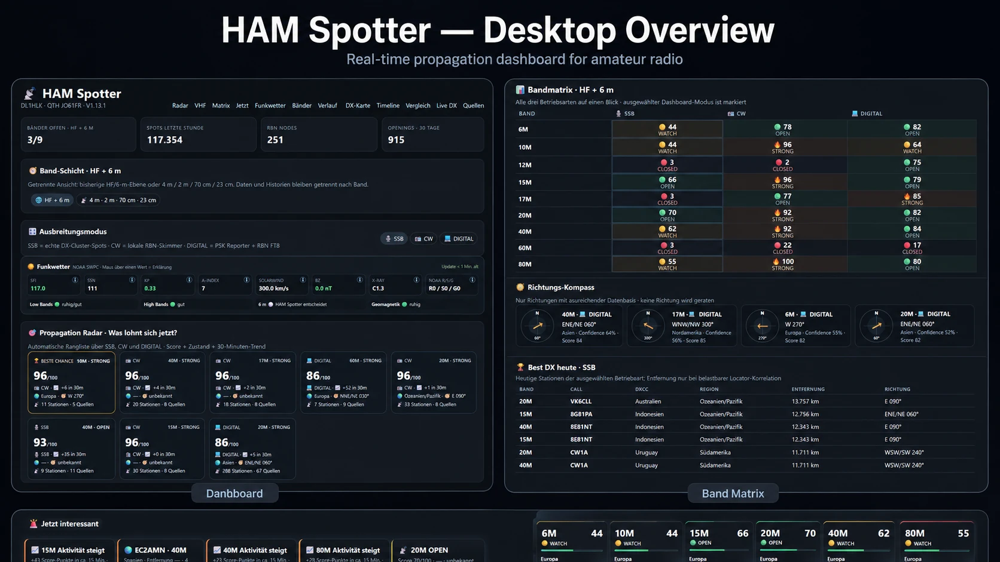
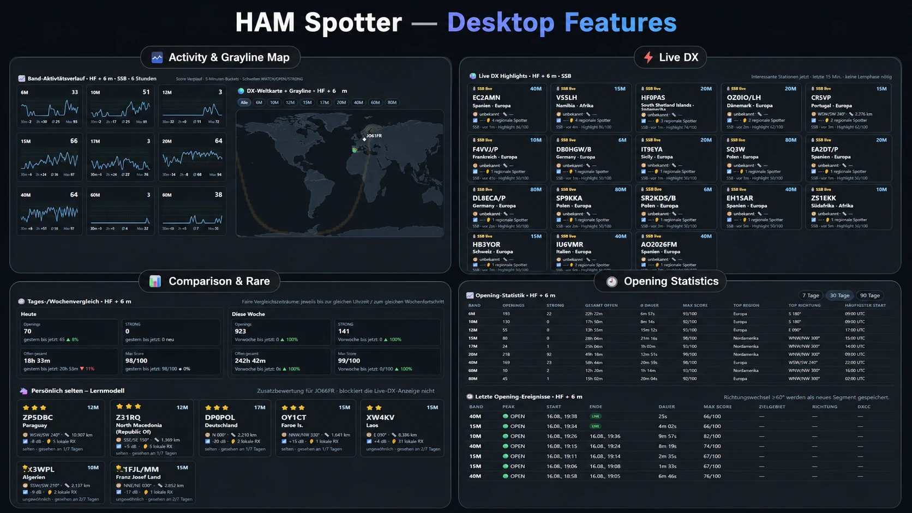
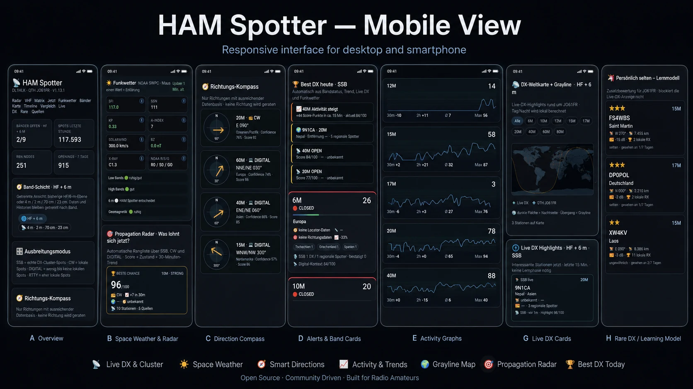

# HAM Spotter

**Live-Ausbreitungsdashboard für den Amateurfunk auf HF, VHF und UHF.**

HAM Spotter kombiniert aktuelle Amateurfunk-Beobachtungen und Weltraumwetter-Kontext, um eine praktische Frage zu beantworten: **Welches Band und welche Richtung lohnen sich gerade?**

Das System ist für Raspberry Pi / Debian-basierte Linux-Systeme ausgelegt und läuft in Docker.

> **Aktuelle Version:** 1.13.6  
> **Status:** Hobby-/Community-Software — Ausbreitungsbewertungen sind Hinweise, keine Garantie.

[English](README.md)

## Vorschau

### Desktop-Übersicht



### Desktop-Funktionen



### Mobile Ansicht



## Funktionen

- HF + 6 m: **6 / 10 / 12 / 15 / 17 / 20 / 40 / 60 / 80 m**
- VHF/UHF: **4 m / 2 m / 70 cm / 23 cm**
- getrennte Bewertung für **SSB, CW und DIGITAL**
- PSK Reporter für digitale Aktivität
- Reverse Beacon Network für CW/FT8-Kontext
- DX Cluster für reale SSB-Spots
- CTY.DAT-/DXCC-Anreicherung
- Live-DX und Best-DX
- Richtungssektoren und Propagation Radar
- Opening-Historie und Aktivitätstrends
- VHF-Indikatoren für Tropo, Sporadic-E, Meteor Scatter und Aurora
- NOAA-Funkwetter
- optionale Telegram-Alarme und Befehle
- zentrale Verwaltung mit `hamspotter`
- Kompakt- und Vollbackup mit Restore

## Empfohlene Installation

Auf der GitHub-Seite unter **Releases** die Datei

```text
hamspotter-installer.sh
```

herunterladen und auf dem Raspberry Pi / Linux-Rechner ausführen:

```bash
chmod +x hamspotter-installer.sh
./hamspotter-installer.sh
```

Der Installer beginnt mit einer Sprachauswahl:

```text
Language / Sprache:
  1) English
  2) Deutsch
```

Bei Neuinstallationen ist **Englisch voreingestellt**. Die Auswahl wird lokal als `HAMSPOTTER_LANGUAGE` gespeichert und gilt auch für das `hamspotter`-Verwaltungsmenü. Das Web-Dashboard selbst ist derzeit noch nicht vollständig übersetzt.

Danach fragt der Assistent ab:

- Rufzeichen
- Maidenhead-QTH-Locator
- gewünschte Band-Schichten
- primäre Ansicht SSB / CW / DIGITAL
- Web-Port
- lokalen PSK/RBN-Radius
- Zeitzone
- optional Telegram Bot-Token und Chat-ID

Danach erzeugt er `.env`, baut das Docker-Image, startet den Container, führt einen Healthcheck aus und installiert den Verwaltungsbefehl `hamspotter`.

## Verwaltung

```bash
hamspotter
```

Deutsches Menü:

```text
1  Status
2  Konfiguration
3  Update
4  Backup
5  Restore
6  Logs
7  Neustart
8  Healthcheck
9  Über HAM Spotter
10 Deinstallation
0  Ende
```

Die Sprache des Verwaltungsmenüs kann später geändert werden:

```bash
hamspotter language en
hamspotter language de
```

Bestehende Installationen aus Versionen vor 1.13.2 bleiben nach dem Update zunächst auf Deutsch, bis die Sprache ausdrücklich geändert wird.

Direktbefehle:

```bash
hamspotter status
hamspotter configure
hamspotter backup
hamspotter backup --full
hamspotter restore /pfad/zum/backup.tar.gz
hamspotter logs
hamspotter restart
hamspotter healthcheck
hamspotter about
hamspotter version
```

## Docker-Aufbau

HAM Spotter läuft über Docker Compose. Persönliche Daten bleiben außerhalb des Containers:

```text
ham-spotter/
├── .env              # Stationskonfiguration — niemals veröffentlichen
├── data/             # SQLite und persistente Laufzeitdaten
├── backups/          # lokale Backups
├── app/              # Quellcode
└── docker-compose.yml
```

Standardmäßig läuft das Dashboard auf Port `8095`.

## Datenquellen

Zur Laufzeit werden bzw. können genutzt werden:

- PSK Reporter
- Reverse Beacon Network
- DX Cluster / DXSpider
- NOAA Space Weather Prediction Center
- ADIF/DXCC-Ressourcen
- CTY.DAT

Die Dienste gehören nicht zu diesem Projekt; Verfügbarkeit und Datenqualität können schwanken.

## Datenschutz

Geografische Berechnungen basieren auf dem eingestellten Maidenhead-Locator. Beim DX-Cluster wird das konfigurierte Rufzeichen als Login verwendet, sofern der Server dies verlangt.

**Niemals `.env`, Backups, Datenbank, Telegram-Token oder Chat-ID auf GitHub hochladen.** Die `.gitignore` schützt die üblichen Pfade, trotzdem Änderungen vor jedem Commit prüfen.

Siehe [SECURITY.md](SECURITY.md) und [docs/PRIVACY.md](docs/PRIVACY.md).

## Ausbreitungsbewertung

Die Scores sind Entscheidungshilfen. Bezeichnungen wie Tropo, Es, Meteor Scatter oder Aurora werden aus Beobachtungsmustern und Zusatzdaten abgeleitet und stellen keinen sicheren physikalischen Nachweis dar.

## Entwicklung

```bash
python3 -m venv .venv
source .venv/bin/activate
pip install -r requirements.txt -r requirements-dev.txt
PYTHONPATH=. pytest -q
```

## Mitmachen

Fehlerberichte und gezielte Verbesserungen sind willkommen. Hinweise stehen in [CONTRIBUTING.md](CONTRIBUTING.md).

## ☕ HAM Spotter unterstützen

HAM Spotter ist freie Open-Source-Hobbysoftware. Wenn dir das Projekt nützlich ist und du die Weiterentwicklung unterstützen möchtest, freue ich mich über ein freiwilliges Trinkgeld.

[**Trinkgeld über PayPal senden**](https://paypal.me/RJockwer)

Die Unterstützung ist vollständig freiwillig und hat keinen Einfluss auf den Zugang zur Software oder auf Funktionen.

## Lizenz

HAM Spotter steht unter der **GNU General Public License v3.0 only (GPL-3.0-only)**. Der vollständige Lizenztext liegt in [LICENSE](LICENSE).

Die Software darf unter den Bedingungen der GPL-3.0 verwendet, untersucht, verändert und weitergegeben werden. Werden veränderte Versionen weitergegeben, gelten dafür die entsprechenden GPL-Pflichten zur Bereitstellung des Quellcodes.
